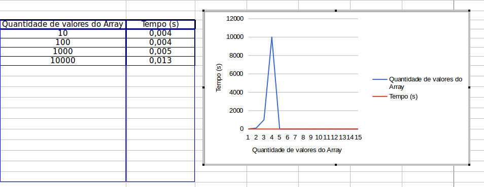

## README

**Trabalho 04**

Disciplina **Projeto de Algoritimo**

Professor **Mauricio Serrano**

Alunos:

|Nome|Matricula|git|
|--|--|--|
|Brian Lui |15/0006802|[@brian2397](https://github.com/Brian2397)|
|Lucas Machado |15/0015917|[@lmmLucasMachado](https://github.com/lmmLucasMachado)|

### **Busca Binaria**

Compile o programa com o comando abaixo:

$ g++ busca_binaria.cpp -o prog_2 -std=c++11

Execute o programa com o comando abaixo:

$ ./ prog_2

Siga os comandos sugeridos pela aplicação:

### Prints aplicação busca binaria

---

### **Merge Sort**

Compile o programa com o comando abaixo:

$ g++ merge.cpp -o prog_1 -std=c++11

Execute o programa com o comando abaixo:

$ ./ prog_1

Siga os comandos sugeridos pela aplicação:

### Prints aplicação Merge

---

### **Grafico de Tempo Merge**

